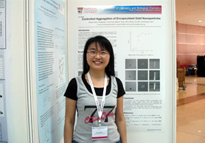

We would like to welcome our newest international group member, PhD candidate Xinjiao Wang. 
Xinjiao recieved her undergraduate degree in China, and M.S. in Singapore. 
She will be working on catalytic applications of nickel complexes.  

