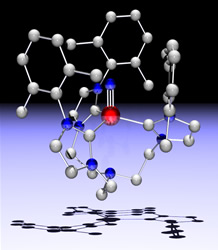

Congratulations to PhD student Carola Vogel on her first publication entitled "An Iron Nitride Complex". 
This Angewandte Chemie paper summarizes her work on the synthesis of discrete iron nitride complexes stabilized by N-anchored tris(carbene) ligands. 
Read the full paper. 
A discussion of the paper was published in Science Editor's Choice (here). 

