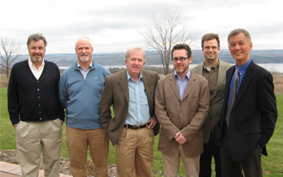

Dr. Cliff Kubiak from the University of California, San Diego campus will be visiting us from Friday, May 4th until Friday, May 24th 2008. 
He will be giving a seminar entitled "Inorganic Mixed Valency at the Delocalized/Localized Borderline:  Ultrafast, Non-Arrhenius, and Solvent-Coupled Electron Transfers" on Thursday, May 15th, and a second lecture on Monday, May 19th entitled "The Catalytic Chemistry of Carbon Dioxide Conversion".

Guests Cliff Kubiak (left) and Peter Wolczanski (2nd from left) with past visitors Christopher Cummins (3rd from right) and Paul Chirik (2nd from right). 

